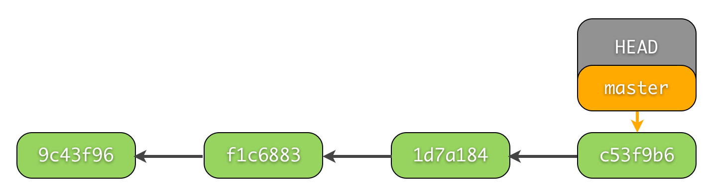

# 回到从前(reset)

## 修改已 commit 的版本

# 首先新建 `2.py` 文件：
```
$ cd Code
$ touch 2.py
$ echo "a=1" > 2.py # 写入文件
```

再使用 `add` 将 `2.py` 变成 staged，然后使用 `--amend` 将此次改变合并到之前的 `change 2` 中：

```
$ git add 2.py
$ git commit --amend --no-edit   # "--no-edit": 不编辑，直接合并到上一个 commit
$ git log --oneline    # "--oneline": 每个 commit 内容显示在一行

# 输出
904e1ba change 2    # 合并过的 change 2
c6762a1 change 1
13be9a7 create 1.py
```

## reset 回到 add 之前

```
$ echo "d=1" > 1.py

$ git add 1.py
$ git status -s # "-s": status 的缩写模式
# 输出
M  1.py     # staged
-----------------------
$ git reset 1.py
# 输出
Unstaged changes after reset:
M	1.py
-----------------------
$ git status -s
# 输出
 M 1.py     # unstaged
```

## reset 回到 commit 之前

在穿梭到 `commit` 之前，需要了解 git 是如何累加更改的，截取 http://bramus.github.io/ws2-sws-course-materials/xx.git.html 的一些图片：




每个 `commit` 都有自己的 `id` 数字号，`HEAD` 是一个指针，指引当前的状态是在哪个 `commit` ，最近的一次 `commit` 在最右边，如果要回到过去，就是让 `HEAD` 回到过去并 `reset` 此时的 `HEAD` 到过去的位置。

```
# 不管我们之前有没有做了一些 add 工作，这一步让我们回到上一次的 commit
$ git reset --hard HEAD    
# 输出
HEAD is now at 904e1ba change 2
-----------------------
# 看看所有的log
$ git log --oneline
# 输出
904e1ba change 2
c6762a1 change 1
13be9a7 create 1.py
-----------------------
# 要回到 c6762a1 change 1 ?

# 方式1: "HEAD^"
$ git reset --hard HEAD^  

# 方式2: "commit id"
$ git reset --hard c6762a1
-----------------------
# 看看现在的 log
$ git log --oneline
# 输出
c6762a1 change 1
13be9a7 create 1.py
```

怎么 `change 2` 消失了？！还有办法挽救消失的 `change 2` 吗？我们可以查看 `$ git reflog` 里面最近做的所有 `HEAD` 的改动，并选择想要挽救的 `commit id`：

```
$ git reflog
# 输出
c6762a1 HEAD@{0}: reset: moving to c6762a1
904e1ba HEAD@{1}: commit (amend): change 2
0107760 HEAD@{2}: commit: change 2
c6762a1 HEAD@{3}: commit: change 1
13be9a7 HEAD@{4}: commit (initial): create 1.py
```
重复 `reset` 步骤就能回到 `commit (amend): change 2 (id=904e1ba)` 这一步了：

```
$ git reset --hard 904e1ba
$ git log --oneline
# 输出
904e1ba change 2
c6762a1 change 1
13be9a7 create 1.py
```
我们又再次奇迹般的回到了 `change 2` 。


