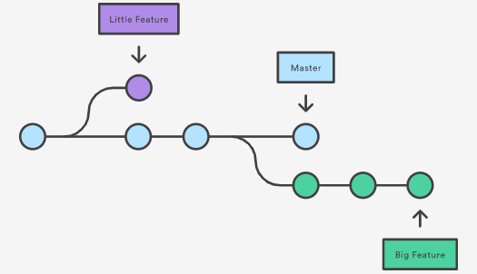

# 分支 (branch)

很多时候我们需要给自己或者客户用一个稳定的版本库，然后同时还在开发另外一个升级版。自然而然，我们会想到把这两者分开处理，用户使用稳定版， 我们开发我们的开发版。**不过 git 的做法却不一样，它把这两者融合成了一个文件，使用不同的分支来管理。** 所以这一节我们来说说 git 中的 分支 Branch。

## 分支 图例

我们所编辑的改变都是在一条主 `master` 上，通常会将 `master` 当成最终的版本。开发新版本或者新属性的时候，在另外的分支上进行，这样就能使开发和使用互不干扰。图片网址：https://www.atlassian.com/git/tutorials/using-branches



## 使用 branch 创建 dev 分支

之前的文件中，只有一条 `master`，可以通过 `--graph` 来观看分支：

```
$ git --oneline --graph

# 输出
* 47f167e back to change 1 and add comment for 1.py
* 904e1ba change 2
* c6762a1 change 1
* 13be9a7 create 1.py
```

接着我们建立另一个分支 `dev`，并查看所有分支：
```
$ git branch dev    # 建立 dev 分支
$ git branch        # 查看当前分支

# 输出
  dev       
* master    # * 代表了当前的 HEAD 所在的分支
```

## 使用 checkout 创建 dev 分支

当我们想把 `HEAD` 切换去 `dev` 分支的时候，我们可以用到上次说的 `checkout`：

```
$ git checkout dev

# 输出
Switched to branch 'dev'
--------------------------
$ git branch

# 输出
* dev       # 这时 HEAD 已经被切换至 dev 分支
  master
```

## 在 dev 分支中修改

使用 `checkout -b` + 分支名，就能直接创建和切换到新建的分支：

```
$ git checkout -b dev

# 输出
Switched to a new branch 'dev'
--------------------------
$ git branch

# 输出
* dev       # 这时 HEAD 已经被切换至 dev 分支
  master
```

## 将 dev 的修改推送到 master 

`dev` 分支中的 `1.py` 和 `2.py` 和 `master` 中的文件是一模一样的。 因为当前的指针 `HEAD` 在 `dev` 分支上， 所以现在对文件夹中的文件进行修改将不会影响到 `master` 分支。

我们在 `1.py` 上加入这一行 `# I was changed in dev branch`， 然后再 `commit`：

```
$ echo "# I was changed in dev branch" > 1.py

$ git commit -am "change 3 in dev"  # "-am": add 所有改变 并直接 commit
```

如果开发版 `dev` 已经更新，要将 `dev` 中的修改推送到 `master` 中，就能使用到正式版中的新功能了。

**首先要切换到 `master` 中，再将 `dev` 切换过来：**

```
$ git checkout master # 切换至 master 才能把其他分支合并过来

$ git merge dev # 将 dev merge 到 master 中
$ git log --oneline --graph

# 输出
* f9584f8 change 3 in dev
* 47f167e back to change 1 and add comment for 1.py
* 904e1ba change 2
* c6762a1 change 1
* 13be9a7 create 1.py
```
**注意：**如果直接 `git merge dev`，·git· 会采用默认的 `Fast forward` 格式进行 `merge`，这样 `merge` 的这次操作不会有 `commit` 信息。 `log` 中也不会有分支的图案。 我们可以采取 `--no-ff` 这种方式保留 `merge` 的 `commit` 信息。


