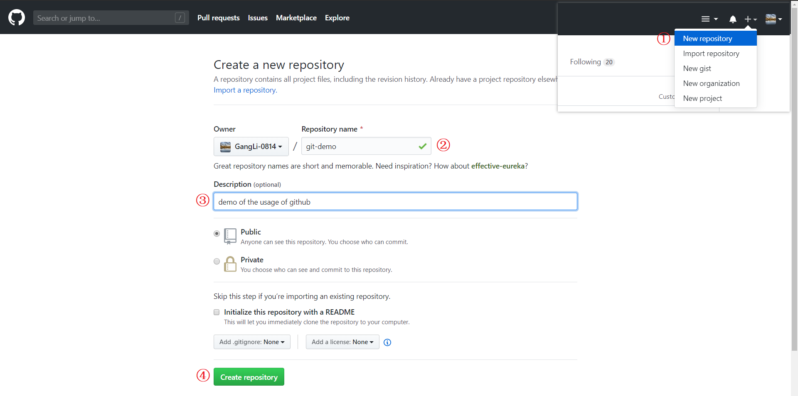
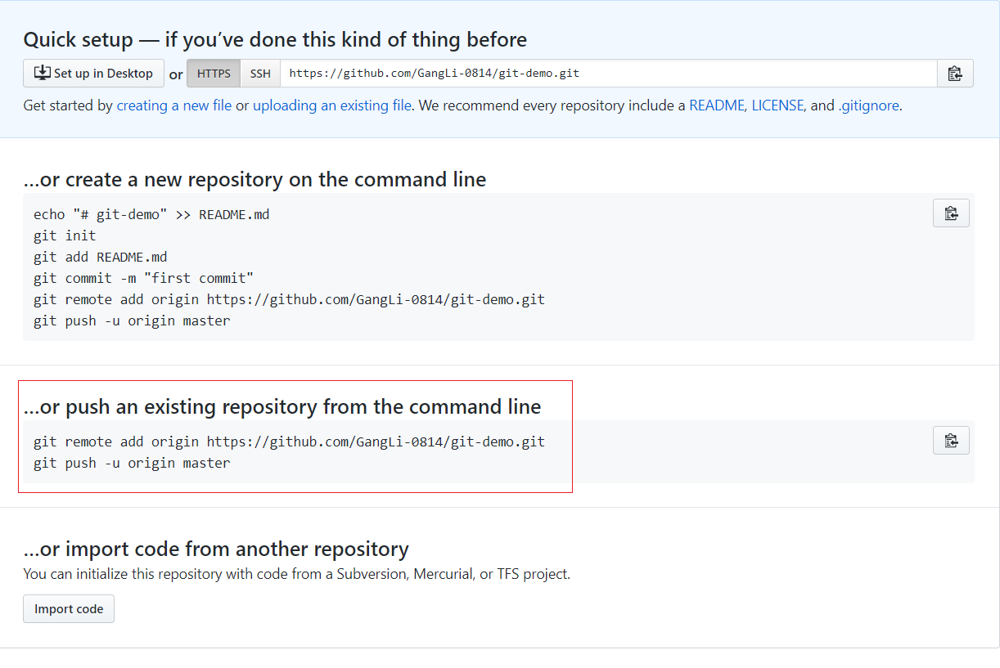
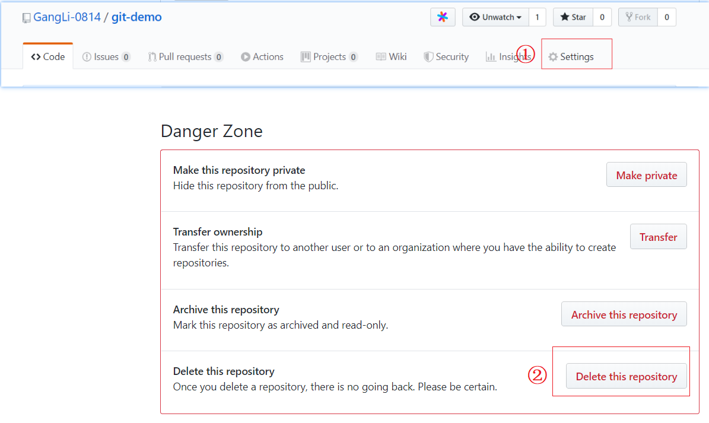

# Github 在线代码管理

> Github 是一个大家都积极贡献的地方，你可以和各种人合作创作。也是开源的天堂~ 只要你愿意，任何人都能下载或修改你的杰作。

## 建立 github 版本库



如上图，共四步添加新的分支，之后会出现如下介绍，可以选择红框里的代码链接上你的本地版本库。



## 删除 github 版本库



进入对应分支之后点击上方 `setting` 在最下方选择删除，验证通过之后就可以删除。

## 连接本地版本库 

```
$ git remote add origin https://github.com/GangLi-0814/gitTutorial.git
$ git push -u origin master     # 推送本地 master 去 origin
$ git push -u origin dev        # 推送本地 dev  去 origin
```

之后网页上就有推上去的版本了，可以在在 `history` 中查看做了哪些修改。

## 推送修改
如果在本地再进行修改，比如在 `1.py` 文件中加上 `# happy github`，然后 `commit` 并推上去：

```
$ cd Code
$ echo "# happy github" > 1.py

$ git commit -am "change 5"
$ git push -u origin master
```
